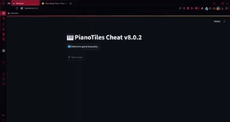

# PianoTiles Autoclicker
---
### Description
Its an autoclicker... It was only tested on [gamesgames](https://www.gamesgames.com/game/magic-piano-tiles).
Just a little quick fun project with a GUI made by Streamlit.

### Usage
1. git clone https://github.com/cvcvka5/PianoTiles-Cheat.git
2. cd ./PianoTiles-Cheat
3. pip install requirements.txt
4. streamlit run ./main.py
---
